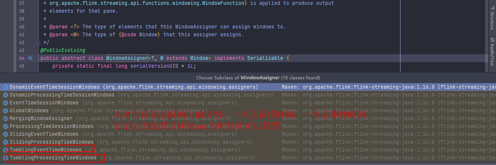

 1.准备环境
 
2、设置运行参数，如并行度（parallelism），运行模式(runtimeMode)
    并行度：

    可以有4种级别来设置Operator的并行度
    1. Operator Level（算子级别）
    2. Execution Environment Level（执行环境级别）
    3. Client Level（客户端级别）
    4. System Level（系统默认级别，不推荐，因为会影响所有作业）

    运行模式
    RuntimeExecutionMode 流处理，批处理，自动

3、指定数据源(术语：自定义source 和 系统定义的datasource)
    
    系统datasource
    基于文件(可以是本地文件，也可以是hdfs地址，还能分批读取)
    基于socket
    基于集合

    自定义source(
        常规的需要实现 SourceFunction 接口中的 cancel 和 run方法， 具体看MyFlinkDataSource
        有并行度的实现 ParallelSourceFunction 接口中的，

        实现RichSourceFunction, 可以定义mysql数据源
    )
    系统内置提供了一批connectors, kafka...
    流的种类：BroadcastStream（广播流），.getSideOutput()（侧流）
4、数据处理，转换

    数据处理，继承KeyedBroadcastProcessFunction，实现自己的逻辑，在stream.process中调用
    flink提供了8个ProcessFunction：
        ProcessFunction dataStream
        KeyedProcessFunction 用于KeyedStream，keyBy之后的流处理
        CoProcessFunction 用于connect连接的流
        ProcessJoinFunction 用于join流操作
        BroadcastProcessFunction 用于广播
        KeyedBroadcastProcessFunction keyBy之后的广播
        ProcessWindowFunction 窗口增量聚合
        ProcessAllWindowFunction 全窗口聚合

5、数据输出

    自定义输出：实现RichSinkFunction，实现open，cancle等接口

6、执行程序

7、懵逼入门名词：Flink CDC技术，SPI机制，任务执行模式

    Flink CDC: change data capture, 数据变更，通俗来说是指数据同步

